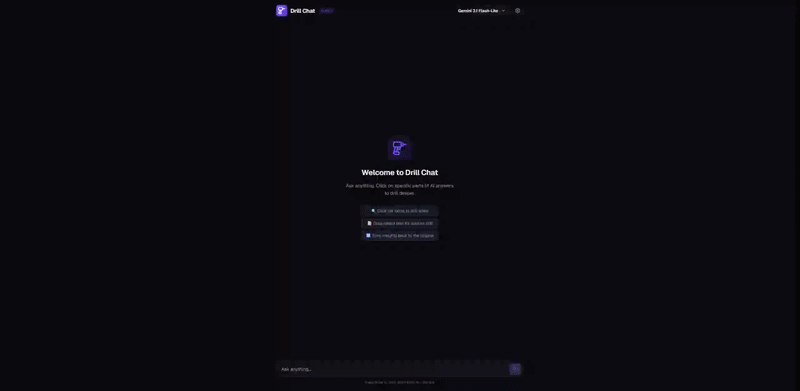
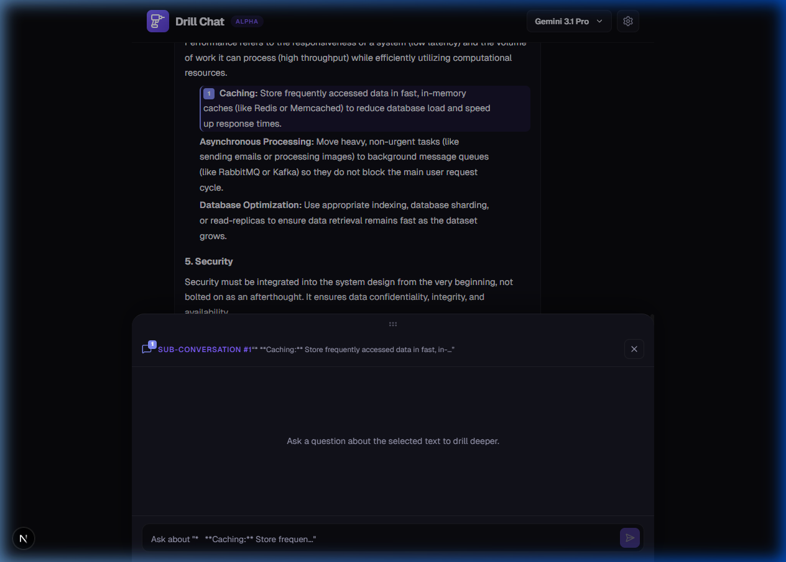
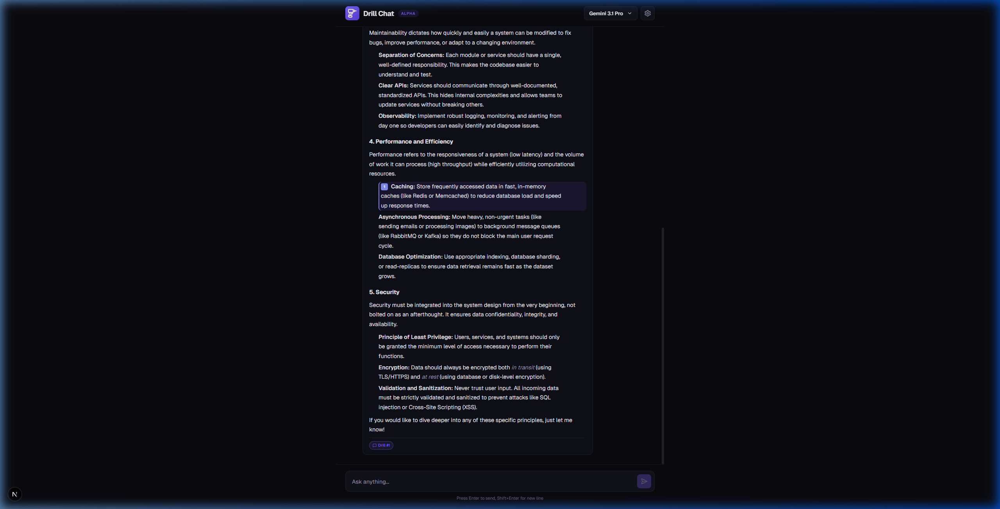
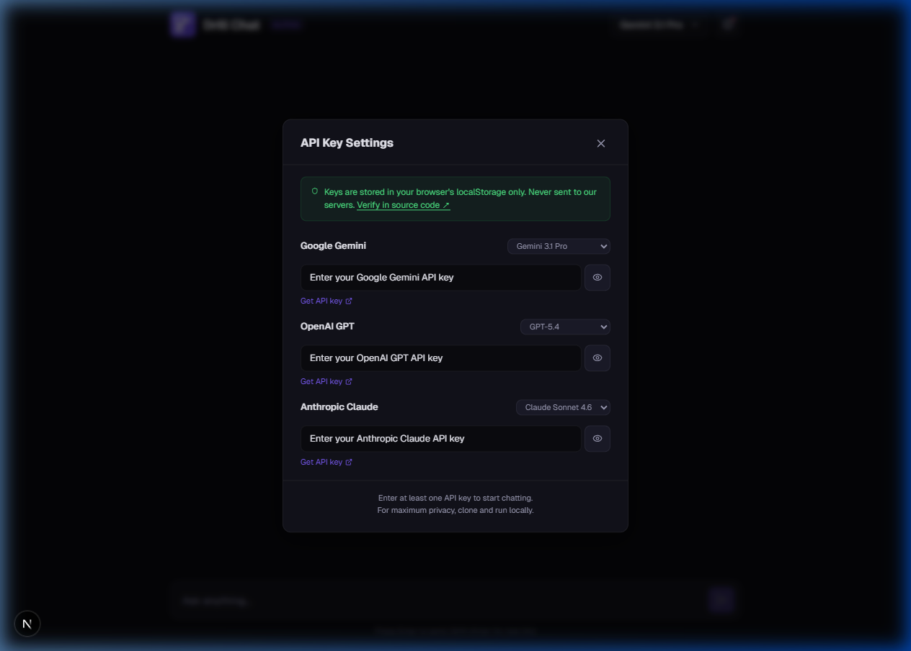

# Drill Chat

> **Changing the depth of conversation.**
> Select any part of an AI answer to open an inline sub-conversation — then sync the insights back into the original response.

[](https://drill-chat.vercel.app)
[](./LICENSE)
[](https://nextjs.org)

---

<p align="center">
  
</p>

<p align="center">
  <em>Ask a question → Drill into a specific part → Get a focused answer → Sync it back into the original.</em>
</p>

---

## 💡 Why I Built This

I didn't build this to promote my product. I built it because **I was frustrated**.

Every time I use ChatGPT, Claude, or Gemini, I run into the same problems:

1. **I want to explore one specific point** in the AI's answer — but asking a follow-up question means the AI generates an entirely _new_ response, burning output tokens and losing focus on everything else.

2. **Conversations drift.** After 3-4 exchanges, I've forgotten what the original answer even said. I scroll back up, try to mentally stitch context together, or ask the AI to "summarize everything so far" — wasting even more time and tokens.

3. **There's no way to surgically update just one part** of a great answer. If point #2 out of 5 needs more detail, my only option is to regenerate the whole thing.

Drill Chat solves all three problems. And honestly? **I want the big AI services to steal this idea.** If ChatGPT, Claude, or Gemini adopted drill-down sub-conversations with sync-back, every AI user in the world would benefit. That's why I'm sharing this as open source — not to build a competing product, but to demonstrate what's possible and hopefully push the entire ecosystem forward.

---

## 🔍 The Problem: AI Conversations Are One-Dimensional

Every AI chat today is a flat, linear stream:

```
You:  "How do I design a scalable system?"
AI:   1. Modularity  2. Scalability  3. Maintainability  4. Performance  5. Security
You:  "Tell me more about #4"
AI:   (generates a completely new response — previous answer is gone from focus)
You:  "Wait, what were the other 4 again?"
AI:   (lost context, you scroll up, start over)
```

**The core issue:** When you want to dig deeper into _one part_ of an answer, the entire conversation resets around that single topic. The original answer — the big picture — gets abandoned.

### What Drill Chat Does Differently

```
You:  "How do I design a scalable system?"
AI:   1. Modularity  2. Scalability  3. Maintainability  4. Performance  5. Security

        → You click "Caching" under Performance to drill down
        → A sub-conversation opens INLINE, below the original answer
        → You ask: "When should I use Redis vs Memcached?"
        → You get a detailed comparison — original answer stays untouched above

        → Click "Sync back" → the Caching section gets enriched
        → One complete, enhanced answer — no context lost
```

**Result:** Your original answer is preserved and progressively enriched, not replaced. No wasted tokens. No lost context.

---

## ✨ Core Features

### 🔎 Inline Sub-Conversations (Drill-Down)

Click the **Drill** button on any list item, heading, or drag-select any text in an AI response. A sub-conversation panel opens at the bottom — the original answer stays visible above.

<p align="center">
  
</p>

### 🔄 Surgical Sync-Back

When you're done exploring, click **"Sync back"**. Drill Chat uses a markdown section parser to identify only the relevant section and rewrites _just that part_ — not the entire answer. This reduces output tokens by up to **~75%** compared to full regeneration.

<p align="center">
  
</p>
<p align="center">
  <em>After sync-back: the "Drill #1" badge marks the enriched section. The rest of the answer is untouched.</em>
</p>

### 🌳 Tree-Structured Conversations

Conversations are managed as tree structures. Each message can have multiple sub-conversations (drills), and each drill maintains its own context. You never lose the big picture.

### 🔑 BYOK (Bring Your Own Key)

Your API keys are stored in your browser's localStorage only — **never sent to our servers**. Supports multiple providers simultaneously:

<p align="center">
  
</p>

- **Google Gemini** (3.1 Pro, 3 Flash, and more)
- **OpenAI GPT** (5.4, 5.4 Thinking, 5.4 mini, and more)
- **Anthropic Claude** (Opus 4.6, Sonnet 4.6, Haiku 4.5, and more)

---

## 🆚 Before / After

|                                | Traditional AI Chat                       | Drill Chat                                         |
| ------------------------------ | ----------------------------------------- | -------------------------------------------------- |
| **Exploring a specific point** | Generate a new message → lose big picture | Drill inline → original stays visible              |
| **After 5+ exchanges**         | Scroll up, re-read, "summarize so far"    | Original answer is always right there              |
| **Enriching one section**      | Regenerate entire answer (100% tokens)    | Sync-back rewrites only that section (~25% tokens) |
| **Managing context**           | Linear — everything in one thread         | Tree — parallel explorations, no interference      |

---

## 🛠 Tech Stack

| Category         | Technology                  |
| ---------------- | --------------------------- |
| Framework        | Next.js 16 (App Router)     |
| Language         | TypeScript                  |
| LLM Integration  | Vercel AI SDK               |
| State Management | Zustand                     |
| Styling          | CSS (Custom Design System)  |
| Markdown         | react-markdown + remark-gfm |
| Deployment       | Vercel                      |

---

## 🚀 Getting Started

### Prerequisites

- Node.js 18+
- An API key from at least one provider (Google, OpenAI, or Anthropic)

### Option 1: Use the Live Demo

Visit **[drill-chat.vercel.app](https://drill-chat.vercel.app)**, click the ⚙️ Settings icon, enter your API key, and start chatting.

### Option 2: Run Locally

```bash
git clone https://github.com/shdomi8599/Drill-Chat.git
cd Drill-Chat
npm install
npm run dev
```

Open [http://localhost:3000](http://localhost:3000) — click ⚙️ to enter your API key in the browser.

> **Privacy note:** When running locally, API calls go directly from your machine to the LLM provider. No intermediary servers.

---

## 📖 Documentation

- [Concept Document](./docs/sub_tasker_concept.md) — The original idea and UX design rationale
- [Roadmap](./docs/drill_chat_roadmap.md) — Full development roadmap and strategic decisions

---

## 🤝 Contributing

Contributions are welcome! Whether it's bug fixes, feature suggestions, or UX improvements — feel free to open an issue or submit a PR.

## 📄 License

[MIT License](./LICENSE) — Use it, fork it, learn from it. If the big players adopt this pattern, we all win.

---

<p align="center">
  <strong>Drill Chat</strong> — Inline sub-conversations with sync-back for AI chat interfaces.
  <br/>
  <em>Because AI conversations deserve more than one dimension.</em>
</p>
